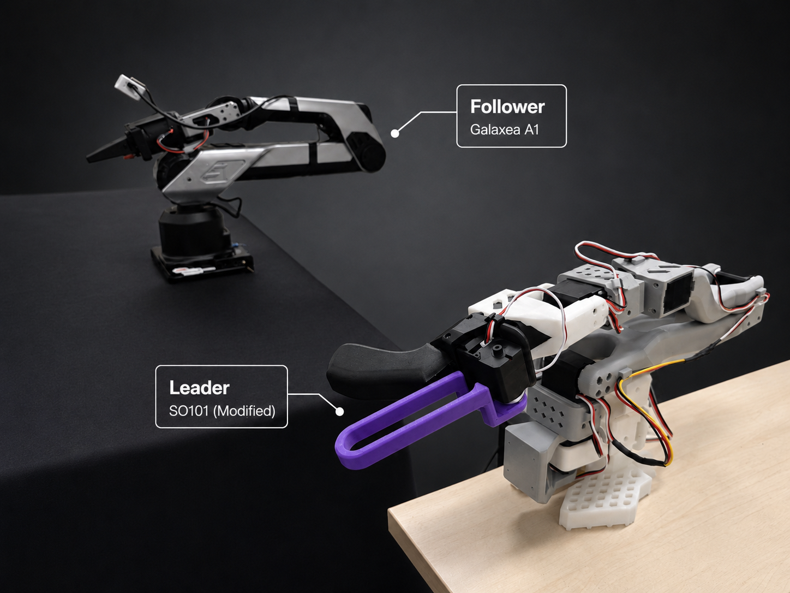
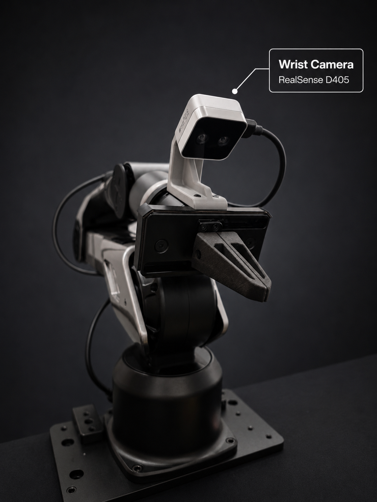

<h1 align="center">Galaxea A1 Runtime</h1>

<p align="center">
  Teleoperation, LeRobot data collection, and policy deployment for a Galaxea A1 arm.
</p>

<p align="center">
  <a href="https://huggingface.co/docs/lerobot/v0.6.0/en/integrate_hardware"></a>
  
  
  <a href="https://arxiv.org/abs/2607.08283"></a>
</p>



This repository is the composition root for the A1 system. It owns ROS,
hardware access, safety, process lifecycle, and policy deployment. Reusable
collection, evaluation, and artifact workflows and the LeRobot hardware adapters
are kept in independent packages.

## Capabilities

- Teleoperate the A1 with a modified six-axis SO-101 leader and continuous
  gripper control.
- Record synchronized joint, EEF, action, gripper, and paired-camera samples
  directly as an atomically committed LeRobotDataset v3.0 dataset.
- Derive Joint or EEF LeRobotDataset v2.1 outputs, or an EEF v3.0 output,
  directly from the canonical dataset.
- Deploy LingBot EEF and OpenPI pi0.5 EEF policies through isolated trackers
  and a fail-closed command relay.
- Operate collection, evaluation, resets, cameras, and tracked batch plans from
  a localhost control panel.

## Supported baseline

| Component | Baseline |
| --- | --- |
| Host application | Python 3.12 |
| OpenPI backend | Python 3.11, isolated from the main environment |
| Robot framework | LeRobot 0.6 |
| ROS runtime | ROS 1 Noetic in an Ubuntu 20.04 container |
| Canonical recording | LeRobotDataset v3.0 |
| Training derivatives | Joint v2.1, EEF v2.1, or EEF v3.0 |

Hardware, safety, camera, collection, and deployment behavior comes from
strict tracked configuration, not per-run flags.

## Quick start

```bash
git submodule update --init --recursive
just setup
docker compose -f docker-compose.a1-noetic.yml build a1-noetic
just check
```

`just check` is hardware-free. Before any command that can move the arm,
follow the acceptance and workspace checks in the
[Runbook](docs/RUNBOOK.md).

## Package boundaries

| Repository | Responsibility |
| --- | --- |
| [embodied-ops](https://github.com/pengyue-polaron/embodied-ops) | Hardware-independent collection, evaluation, and atomic artifact workflows |
| [lerobot-robot-galaxea-a1](https://github.com/pengyue-polaron/lerobot-robot-galaxea-a1) | Auto-discovered LeRobot `Robot` client for the A1 Runtime |
| [lerobot-teleoperator-galaxea-a1-so-leader](https://github.com/pengyue-polaron/lerobot-teleoperator-galaxea-a1-so-leader) | Auto-discovered LeRobot `Teleoperator` for the modified SO-101 leader |

The Robot plugin communicates with this Runtime through its own A1-specific local
Unix-socket transport. It does not import the Runtime package or own ROS. The
Teleoperator plugin owns only its serial bus and reports truthful leader units.

Both plugins follow LeRobot's third-party discovery conventions. The A1 pair
must still be composed by this Runtime: LeRobot 0.6's generic CLI selects
identity processors, while this setup requires pair-specific degree-to-radian,
relative-anchor, sign, scale, bias, limit, and gripper mapping.

## Hardware

The reference setup pairs a Galaxea A1 follower with a modified SO-101 leader.
Collection uses an Intel RealSense D405 wrist camera and a configured AgentView
camera.

<p align="center">
  
</p>

- [D405 wrist-camera holder](assets/cad/d405_wrist_camera_holder/README.md)
- [Modified SO-101 leader parts](assets/cad/so100_leader/README.md)

## Repository map

| Path | Purpose |
| --- | --- |
| `galaxea_a1_runtime/` | Runtime, hardware, collection, policy, and conversion modules |
| `scripts/` | Thin application and lifecycle entrypoints |
| `configs/` | System, data, backend, model, and deployment contracts |
| `docker/` | ROS Noetic execution environment |
| `external/` | Pinned SDK and LeRobot plugin submodules |
| `third_party/` | Pinned vendor snapshots; no A1-specific behavior |
| `assets/` | Setup images and mechanical files |
| `data/`, `outputs/`, `models/` | Ignored datasets, run results, and model weights |

## Documentation

| Document | Covers |
| --- | --- |
| [Runbook](docs/RUNBOOK.md) | Setup, operation, expected results, and recovery |
| [Safety](docs/SAFETY.md) | Control paths, relay invariants, and debug constraints |
| [Architecture](docs/ARCHITECTURE.md) | Layers, ownership, data contracts, and artifact layout |
| [Environment](docs/SETUP_ENV.md) | Python, LeRobot, ROS, and model environments |
| [udev setup](docs/SETUP_UDEV.md) | Persistent A1 serial permissions and device alias |
| [Model registry](models/README.md) | Model artifacts and inference backends |

## Research

The real-robot experiments in
[TFP: Temporally Conditioned Memory-Fusion Policies for Visuomotor Learning](https://arxiv.org/abs/2607.08283)
used this Galaxea A1 platform.

Yushen Liang, Yue Peng, Baosheng Jin, et al. · SemRob 2026 @ RSS 2026
