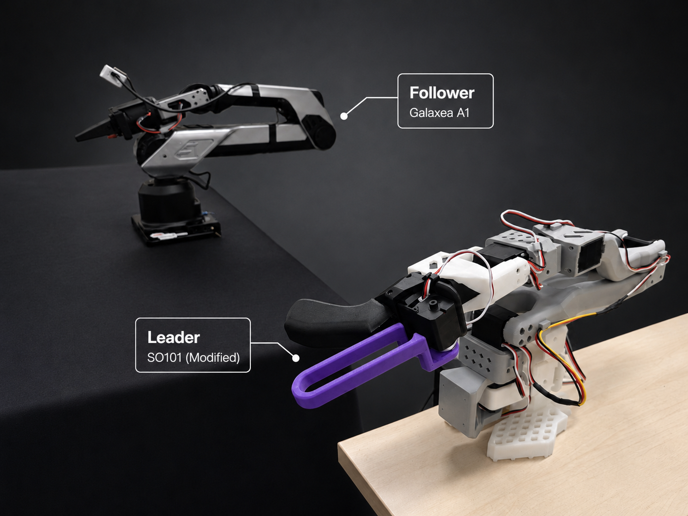
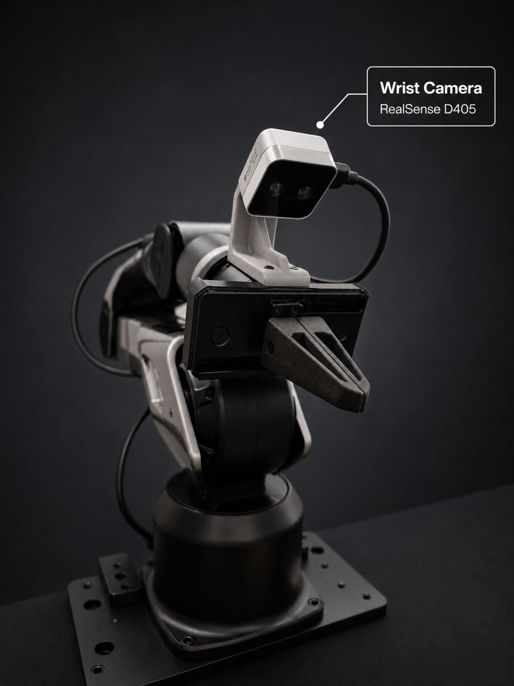

<h1 align="center">Galaxea A1 Runtime</h1>

<p align="center">
  Teleoperation, LeRobot data collection, and policy deployment for a Galaxea A1 arm.
</p>

<p align="center">
  <a href="https://huggingface.co/docs/lerobot/v0.6.0/en/integrate_hardware"></a>
  
  
  <a href="https://arxiv.org/abs/2607.08283"></a>
</p>



This repository is the composition root for the A1 system. It owns ROS,
hardware access, safety, process lifecycle, and policy deployment. Reusable
collection, evaluation, and artifact workflows and the LeRobot hardware adapters
are kept in independent packages.

## Capabilities

- Teleoperate the A1 with a modified six-axis SO-101 leader and continuous
  gripper control.
- Record synchronized joint, EEF, action, gripper, and paired-camera samples
  directly as an atomically committed LeRobotDataset v3.0 dataset.
- Derive Joint or EEF LeRobotDataset v2.1 outputs, or an EEF v3.0 output,
  directly from the canonical dataset.
- Deploy LingBot EEF and OpenPI pi0.5 EEF policies through isolated trackers
  and a fail-closed command relay.
- Operate collection, dataset inspection/export, evaluation, resets, cameras,
  and tracked batch plans from a compact shadcn/ui control panel.
- Inspect cameras, named joint/gripper signals, diagnostics, ROS logs, TF, and
  the configured URDF through a persistent scoped Foxglove workspace whose
  canonical organization layout is published automatically from `main`.

## Supported baseline

| Component | Baseline |
| --- | --- |
| Host application | Python 3.12 |
| OpenPI backend | Python 3.11, isolated from the main environment |
| Robot framework | LeRobot 0.6 |
| ROS runtime | ROS 1 Noetic in an Ubuntu 20.04 container |
| Canonical recording | LeRobotDataset v3.0 |
| Training derivatives | Joint v2.1, EEF v2.1, or EEF v3.0 |

Hardware, safety, camera, collection, and deployment behavior comes from
strict tracked configuration, not per-run flags.

## Quick start

```bash
git submodule update --init --recursive
just setup
docker compose -f docker-compose.a1-noetic.yml build a1-noetic
just check
```

`just check` is hardware-free. Before any command that can move the arm,
follow the acceptance and workspace checks in the
[Runbook](docs/RUNBOOK.md).

## Persistent Foxglove observability

```bash
just cameras start
```

That command ensures the paired-camera service and the shared observation
stack. Connect Foxglove to `ws://<runtime-host>:8766` and select the organization
layout **Galaxea A1 Operations**. The layout presents both camera streams,
diagnostics, measured and commanded joint/gripper plots, ROS logs, sanitized
Embodied Ops workflow status, the **Embodied Ops Collection Console**, and a 3D
panel backed by the configured URDF and TF tree. The English-only collection
console is intentionally limited to one status and five controls; the 3D view
shares a compact tab with diagnostics and is hidden by default.

The 3D panel is analogous to RViz's RobotModel plus TF view: while an execution
runtime owns the arm and publishes measured joint feedback, the rendered model
follows the reported physical pose. With the arm powered off, camera monitoring
continues and unavailable robot signals remain explicitly absent rather than
being simulated.

The observation stack survives ordinary `just stop` transitions so it remains
available between applications and across arm power cycles. `just cameras stop`
is the explicit shutdown for both cameras and the observation stack. With the
arm off, the camera panels remain usable and robot signals are reported as
missing; collection buttons remain disabled until a terminal opens a validated
collection session.

Start a session by selecting only its experiment and exact prompt in the
terminal, then leave that command running:

```bash
just collect <experiment> "<exact prompt>"
```

The Foxglove console shows `Ready`, `Preparing`, `Recording`, `Saving`,
`Discarding`, `Resetting`, `Completed`, or an explicit unavailable/error state.
Its compact status includes the episode, exact prompt, saved count, and frame
count; while recording it also shows sampled/stored frames and effective FPS.
`Preparing` covers dataset staging and the fresh-camera barrier, so recording
controls do not open early. In `Ready`, the console offers **Start recording**,
**Reset position**, and **End session**. In `Recording`, it offers **Stop &
save**, **Discard episode**, and **End session**. Reset, discard, and session
stop require confirmation in Foxglove. The terminal continues to show the child
log but no longer needs to accept the episode decisions.

The trusted-LAN bridge exposes only the five exact collection `Trigger`
services generated from System config. It still denies client topic
publication, parameters, client-advertised topics, and every other ROS service.
Each action is checked against the active collection run, semantic phase, and
one-shot input revision before it reaches the supervised child process.

[`foxglove/layouts/a1_observability.json`](foxglove/layouts/a1_observability.json)
is generated from System config and contains the A1 topic/service state for the
pinned, robot-neutral **Embodied Ops Collection Console**. A GitHub Actions
workflow builds that extension from `external/embodied-ops`, publishes it to the
organization, then upserts the **Galaxea A1 Operations** layout whenever relevant
files land on `main`. Organization members therefore receive the panel
automatically and do not need to import a fresh JSON file.

## Package boundaries

| Repository | Responsibility |
| --- | --- |
| [embodied-ops](https://github.com/pengyue-polaron/embodied-ops) | Hardware-independent workflow, versioned operator status, shared Foxglove Collection Console/layout publication, artifact, and LeRobot format mechanics |
| [lerobot-robot-galaxea-a1](https://github.com/pengyue-polaron/lerobot-robot-galaxea-a1) | Auto-discovered LeRobot `Robot` client for the A1 Runtime |
| [lerobot-teleoperator-galaxea-a1-so-leader](https://github.com/pengyue-polaron/lerobot-teleoperator-galaxea-a1-so-leader) | Auto-discovered LeRobot `Teleoperator` for the modified SO-101 leader |

The Robot plugin communicates through the lightweight
`galaxea-a1-runtime-protocol` package released from this repository. It does
not import the Runtime package or own ROS; the Runtime owns the server, leases,
watchdog, and Unix-socket security. The
Teleoperator plugin owns only its serial bus and reports truthful leader units.

Both plugins follow LeRobot's third-party discovery conventions. The A1 pair
and its first-frame hold/relative mapping processor are composed by this
Runtime: LeRobot 0.6's generic CLI selects identity processors, while this
setup requires pair-specific degree-to-radian, relative-anchor, sign, scale,
bias, limit, and gripper mapping.

## Hardware

The reference setup pairs a Galaxea A1 follower with a modified SO-101 leader.
Collection uses an Intel RealSense D405 wrist camera and a configured AgentView
camera.

<p align="center">
  
</p>

- [D405 wrist-camera holder](assets/cad/d405_wrist_camera_holder/README.md)
- [Modified SO-101 leader parts](assets/cad/so100_leader/README.md)

## Repository map

| Path | Purpose |
| --- | --- |
| `galaxea_a1_runtime/` | Runtime, hardware, collection, policy, and conversion modules |
| `scripts/` | Thin application and lifecycle entrypoints |
| `configs/` | System, data, backend, model, and deployment contracts |
| `docker/` | ROS Noetic execution environment |
| `external/` | Pinned SDK and LeRobot plugin submodules |
| `third_party/` | Pinned vendor snapshots; no A1-specific behavior |
| `assets/` | Setup images and mechanical files |
| `data/`, `outputs/`, `models/` | Ignored datasets, run results, and model weights |

## Documentation

| Document | Covers |
| --- | --- |
| [Runbook](docs/RUNBOOK.md) | Setup, operation, expected results, and recovery |
| [Safety](docs/SAFETY.md) | Control paths, relay invariants, and debug constraints |
| [Architecture](docs/ARCHITECTURE.md) | Layers, ownership, data contracts, and artifact layout |
| [Model registry](models/README.md) | Model artifacts and inference backends |

## Research

The real-robot experiments in
[TFP: Temporally Conditioned Memory-Fusion Policies for Visuomotor Learning](https://arxiv.org/abs/2607.08283)
used this Galaxea A1 platform.

Yushen Liang, Yue Peng, Baosheng Jin, et al. · SemRob 2026 @ RSS 2026
